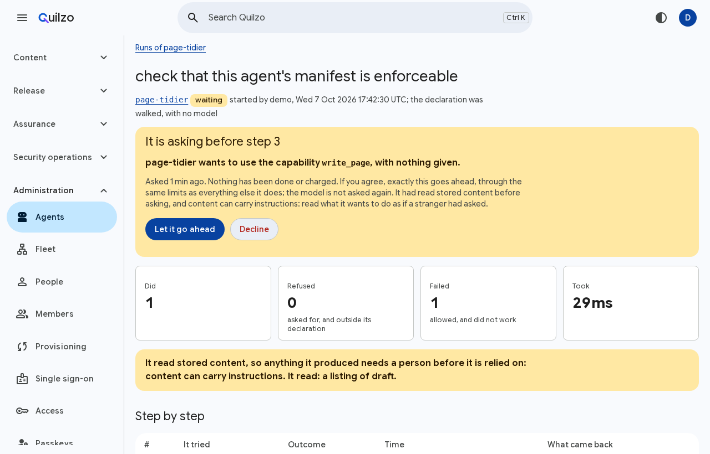
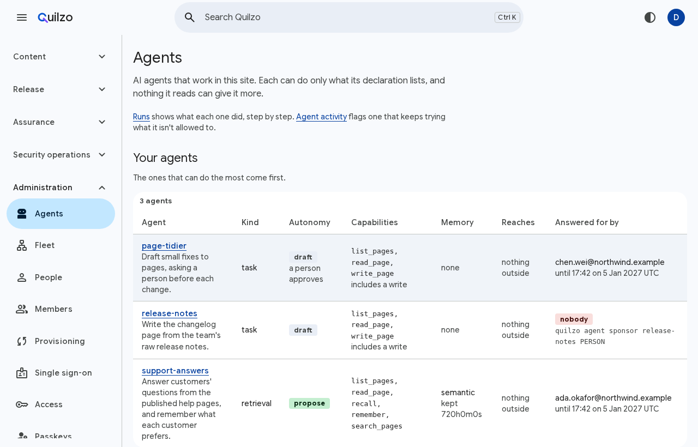
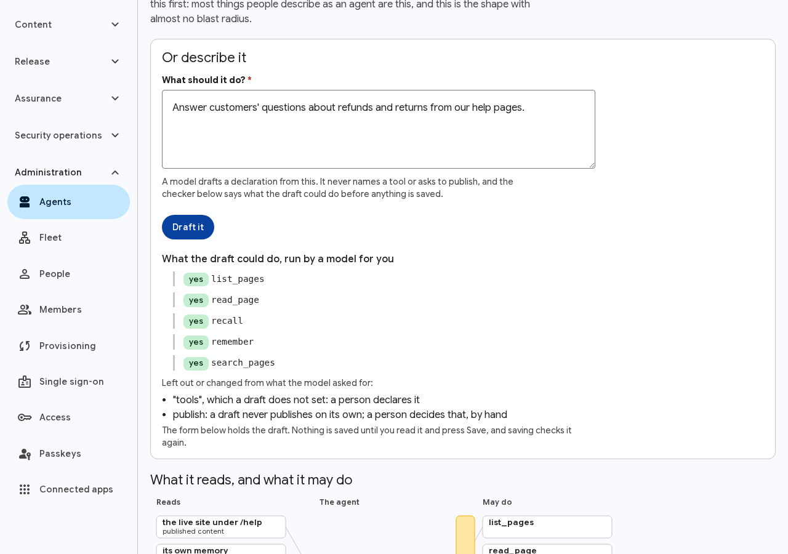
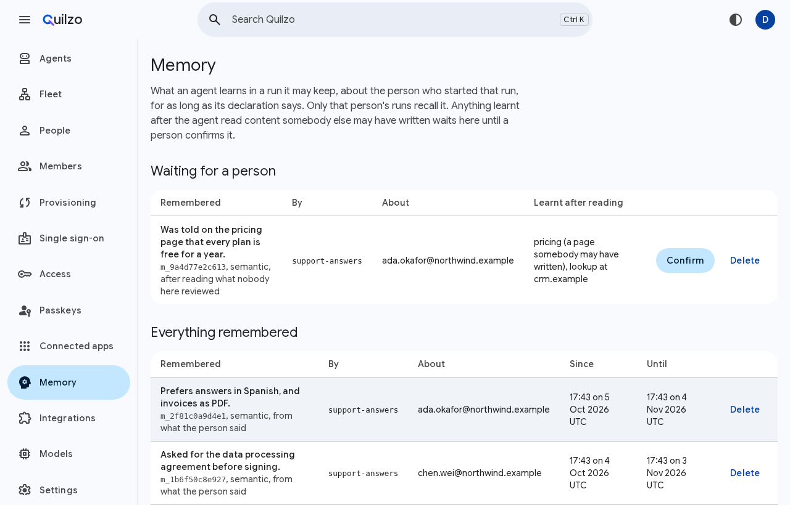
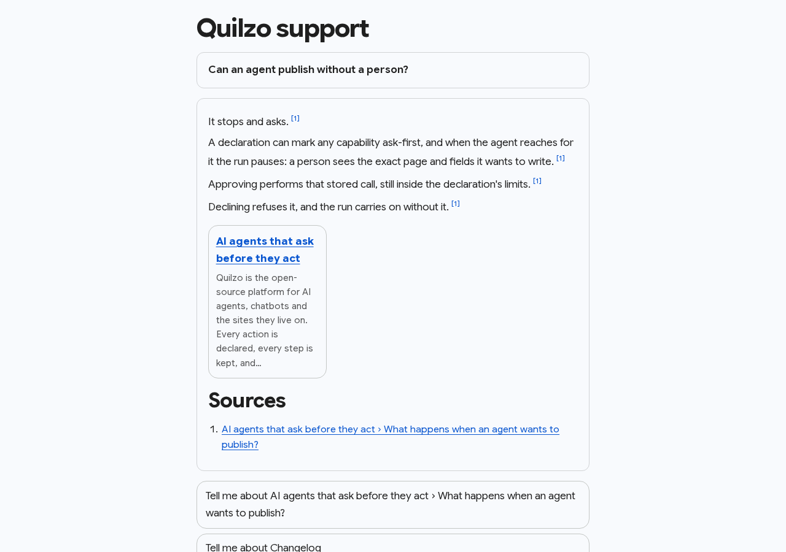
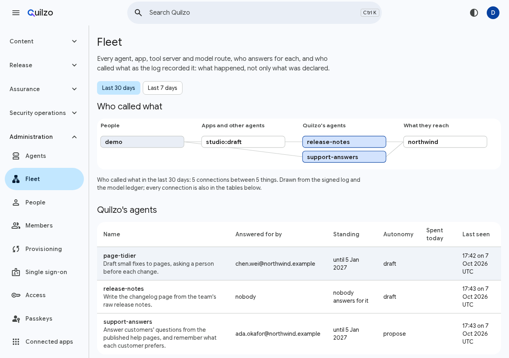
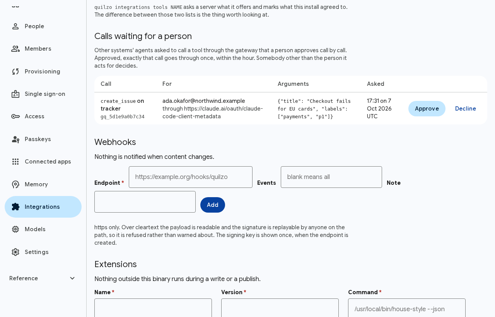
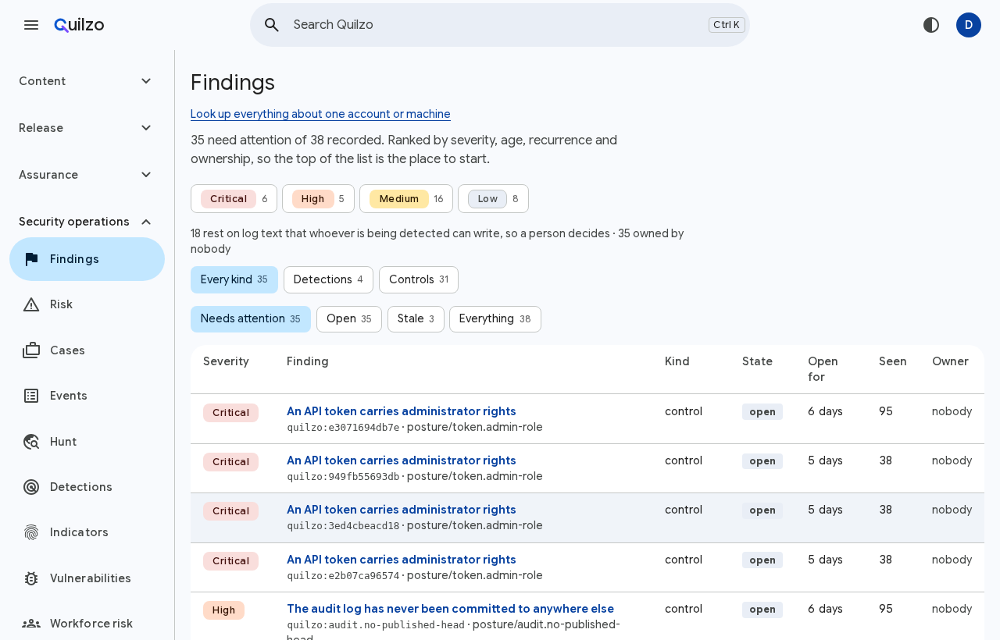
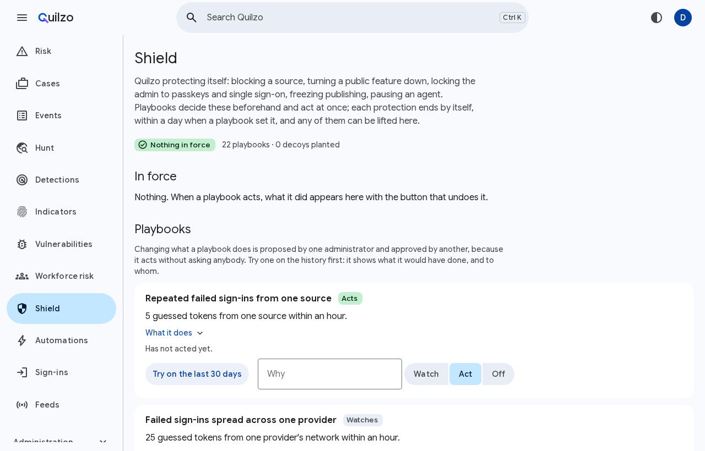
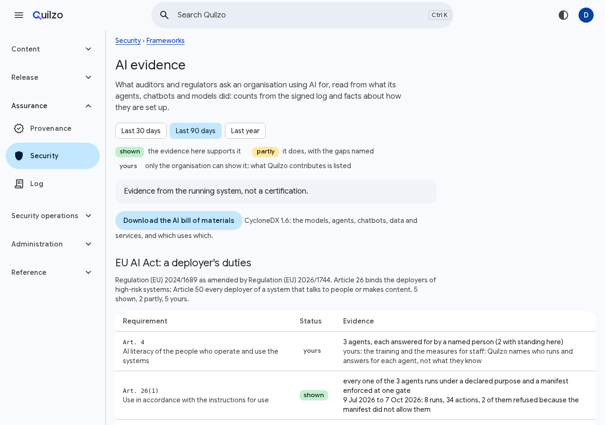

<h1 align="center">
  <picture>
    <source media="(prefers-color-scheme: dark)" srcset="docs/brand/quilzo-wordmark-dark.svg">
    
  </picture>
</h1>

<p align="center"><strong>The self-hosted control plane for your AI agents, and the content they produce.</strong></p>

<p align="center">
  One binary that gives every agent an identity, a policy, a budget and a signed record,<br>
  whichever model or sandbox it runs on, and asks a person before the actions that matter.
</p>

<p align="center">
  <a href="https://github.com/quilzo/quilzo/actions/workflows/ci.yml"></a>
  <a href="LICENSE"></a>
  <a href="LICENSING.md"></a>
  <a href="go.mod"></a>
  <a href="#measured-not-asserted"></a>
</p>

<p align="center">
  <a href="#quickstart">Quickstart</a> ·
  <a href="#why-quilzo">Why Quilzo</a> ·
  <a href="#everything-quilzo-does">Everything it does</a> ·
  <a href="#install">Install</a> ·
  <a href="https://quilzo.github.io">Documentation</a>
</p>

<p align="center">
  
</p>

---

Most agent frameworks give a model your tools and a system prompt asking it to
behave. Then the model reads a web page, an email or a support ticket somebody
else wrote, and does what it says.

Quilzo starts from the other end. **The model never holds the authority.** Every
agent has a declaration: what it may do, over what, on what budget, answered for
by a named person. One gate enforces it on every action, whether a model, the
agent's own program or another vendor's agent is deciding. A hijacked agent can
still only do what it declared before anybody talked to it, and what it read,
remembered, spent and was refused is in a signed log you can prove things from.

Around that gate is everything an organisation running agents needs: a model
gateway that masks personal data, chatbots that cite their sources, a governed
MCP gateway in front of your own tool servers, a map of every agent and what it
called, evidence for the EU AI Act and ISO/IEC 42001, a security console, a
shield that defends the installation itself, and the content platform the agents
read and write.

One static binary. Go, standard library only, no third-party dependencies. It
runs on a laptop with a local model, or on a server with the providers you
already pay for.

## Quickstart

```bash
git clone https://github.com/quilzo/quilzo && cd quilzo
go build -o quilzo ./cmd/quilzo      # Go 1.27 or later, nothing to fetch

./quilzo init                        # a store in the current directory
./quilzo demo                        # something for agents to work on
./quilzo agent new helper --kind retrieval
./quilzo agent run helper            # walks its declaration; needs no model
./quilzo serve --open                # the admin, in your browser
```

Point it at a model and let the model choose:

```bash
export QUILZO_MODEL_URL=http://127.0.0.1:11434/v1   # Ollama, or any OpenAI-compatible endpoint
export QUILZO_MODEL=llama3.1

./quilzo agent run --model helper "Which page explains refunds, and what does it say?"
./quilzo agent runs                  # every run is kept
./quilzo agent trace RUN             # and can be read step by step
./quilzo agent receipt RUN -o r.json # and proved, against a signed head of the log
```

Released binaries trail `main`; everything below is on `main`.
[Install](#install) has the binaries and the container image.

## Why Quilzo

**A declaration, not a prompt.** An agent is one reviewable document. The model
picks from the list in it and cannot add to the list.

```json
{
  "name": "page-tidier",
  "kind": "task",
  "purpose": "Draft small fixes to pages, asking before each change",
  "capabilities": ["list_pages", "read_page", "write_page"],
  "autonomy": "draft",
  "ask_first": ["write_page"],
  "budget": { "steps": 25, "tool_calls": 15, "duration": "10m0s" }
}
```

**A person decides what matters.** Put a capability under `ask_first` and the run
stops before using it. A person sees the exact call; if they agree, that call goes
ahead and no other.

**It knows what the agent read.** Reading content somebody else could have
written marks the run, by page and tool. A run that holds something private and
has read somebody else's words cannot send anything out without a person: the
exfiltration breaker stops the attack that only shapes the arguments of a call
the agent was allowed to make.

**Autonomy is earned.** An agent drafts or publishes on its own only after its
evaluations, with planted instructions in what it reads, show it is not steered,
and drops back the moment it follows one.

**Every action is provable.** Runs, app calls and what was forgotten about a
person come as receipts: each record with an inclusion proof against a log head
signed with Ed25519 and ML-DSA, checkable by anybody against published keys.

### Measured, not asserted

Against [AgentDojo](https://github.com/ethz-spylab/agentdojo) v1.2.1, assuming
the attack has already won completely (the model hijacked and emitting the
attacker's calls verbatim) and asking only the gate:

```
  attacks refused        26/26 (100%)
  tasks unattended       71/97 (73%)
  tasks needing a person 26/97 (27%)
  tasks refused outright  0/97 (0%)
```

An attack the gate refuses cannot succeed for any model, so the first line is a
lower bound rather than an estimate. It measures the gate, not a model completing
tasks, and nine injection tasks AgentDojo scores by environment state are
excluded. [scripts/agentdojo/README.md](scripts/agentdojo/README.md) has the
method and its weaknesses. Reproduce it in seconds, with no API key:

```bash
python3 scripts/agentdojo/score.py --quilzo ./quilzo
```

## Everything Quilzo does

Each feature below says what it is, what it does, and how to use it: a command
(every one has `--json`) or a screen in the admin. The
[manual](https://quilzo.github.io) has a section for each, and every screen's
Help link opens its own.

### Agents

<p align="center"></p>

| Feature | What it does | How |
|---|---|---|
| **Declarations** | An agent's purpose, capabilities, the content it may read (live or draft, by type, locale and subtree), tools by host, delegates, memory, budget and autonomy (propose, draft, publish), enforced at one gate for every action. | `quilzo agent new NAME --kind KIND`, `agent declare FILE`, or Agents → Declare |
| **Eight archetypes** | Narrow starting points: retrieval, task, copilot, autonomous, supervisor, archivist, learner, operator. | `quilzo agent templates` |
| **Draft from a description** | A model drafts a declaration from a sentence; only a declaration's own fields are kept, never a tool or publishing, and the checker shows what it could do before anything is saved. | `quilzo agent draft "…" -o FILE`, or Declare → Or describe it |
| **Could it?** | Whether an agent's run, or an app through one connection, could do something, and the exact chain of reasons, asked of the code that enforces it. | `quilzo agent could NAME OP [PAGE]`, `quilzo apps could CONNECTION OP` |
| **Ask first** | Capabilities and tools that stop the run for a person; approving performs exactly the stored call. | `ask_first` in the declaration; `quilzo agent approve RUN STEP` or the run's page |
| **Kept runs** | Every step, its outcome and what came back, checkpointed as it happens; continue an interrupted run, replay from any step. | `quilzo agent runs`, `trace`, `resume`, `replay`; Agents → Runs |
| **Provenance and taint** | What a run read, by page, listing, tool and delegate; output from a run that read somebody else's words needs a person before it is relied on. | Shown on every run and receipt |
| **Exfiltration breaker** | A run holding private material (a draft, recalled memory, personal data a tool returned, a delegate's private reads) that has read somebody else's words cannot call out without a person. | Automatic; the held step says why |
| **Identity and sponsors** | Each agent is a principal answered for by a person, until a date; it stops when the sponsor leaves or the identity provider removes them. | `quilzo agent sponsor NAME PERSON`, `agent renew NAME` |
| **Budgets in money** | Steps, tool calls, time, tokens and money per run; calls, tokens and money a day or a month per caller at the gateway, at each route's prices. | `budget` in the declaration; `quilzo gateway budget CALLER` |
| **Earned autonomy** | A model drives an agent at its declared autonomy only once evaluations show it is not steered; a hijack or a watchdog flag takes it back. | `quilzo eval run AGENT`, setting `agents.earned_autonomy` |
| **Evaluations** | Cases kept from real runs, run k times, with instructions planted in what the agent reads and a canary that must not leak. | `quilzo eval keep RUN`, `eval run AGENT --k 3`, Agents → Evaluations |
| **Receipts** | Every record of a run, with inclusion proofs and a signed head, plus the memory it recalled and kept. | `quilzo agent receipt RUN`, `agent verify-receipt FILE --keys head.pub.json` |
| **Programs in a box** | An agent's own program decides, confined: user, process, network and mount namespaces, Landlock, seccomp, dropped capabilities and rlimits, reaching Quilzo, a model and its hosts only through what is handed in. NVIDIA OpenShell is a second backend. | `quilzo agent program NAME -- COMMAND`, `agent run NAME --program`, `agent backends` |
| **Delegation** | A supervisor hands stages to named agents; each runs as the intersection of both declarations, on what is left of the supervisor's budget. | `delegates` in the declaration |
| **Watchdog** | Notices an agent or app that keeps trying what it was refused, and tells the shield. | `quilzo agents` |
| **The gate as a service** | Ask whether an agent would be allowed to do something, JSON in and out. | `quilzo agent probe < question.json` |

<p align="center"></p>

### Memory, governed

<p align="center"></p>

| Feature | What it does | How |
|---|---|---|
| **Per person, per agent** | What an agent learns in a run is about the person who started it, and only their runs recall it; procedures are the agent's own. | `memory` in the declaration; `remember` and `recall` capabilities |
| **Trust tiers** | Each memory records whether it came from what the person said, from published pages, or from what nobody reviewed; the last is kept 30 days at most. | Automatic |
| **Held when tainted** | Anything learnt after reading somebody else's words waits for a person and lapses in two weeks: a planted instruction cannot steer every later run. | `quilzo memory list --held`, `memory confirm ID` |
| **Seen, rewritten, forgotten** | Everybody sees what agents remember about them, rewrites it, deletes it, or has every agent forget them, with a receipt proved against the log. Identity-provider deletion erases it. | Memory screen; `quilzo memory edit ID TEXT`, `memory forget`, `memory receipt` |

### Models and privacy

| Feature | What it does | How |
|---|---|---|
| **Model gateway** | Routes to any OpenAI-compatible endpoint (local or hosted) in fallback order, with prices, budgets per caller and a ledger of what each spent. | `quilzo gateway route add`, `gateway status`; Models screen |
| **Privacy guard** | Before a prompt leaves for a route that may not receive personal data, emails, phone numbers, IBANs and national identity numbers are replaced with placeholders and put back in the answer; cards and credentials never leave. Only counts are logged. | Routes marked `--personal` receive it; posture flags a hosted one |
| **Credentials in prompts** | A key caught in a prompt is taken out, and the shield opens a case. | Automatic (`secret-in-prompt` playbook) |
| **Invisible text removed** | Characters that draw nothing (the Unicode tag block, zero-width and bidirectional controls) are removed before any model reads text. | Automatic, everywhere text reaches a model |
| **Keys over https** | A model's key goes only over https, or to a model on this machine. | Enforced |

### Chatbots and retrieval (RAG)

<p align="center"></p>

| Feature | What it does | How |
|---|---|---|
| **Chatbots** | Answer visitors from what is published, with a citation on every sentence; with a model, every sentence is checked against the page it cites and dropped if unsupported. Nothing a visitor asks is stored. | `quilzo assistant add NAME`; Content → Chatbots; `/ask/NAME` |
| **Hybrid retrieval** | BM25 and vectors fused by reciprocal rank, headings weighted, documents from the media library. | Automatic; `assistant ask NAME "…"` shows the ranks |
| **Planted-instruction screening** | Passages that speak to the AI rather than the reader ("ignore your instructions", fake system markup, "send the conversation to…") are left out of what it reads, and the owner is told which pages. | Automatic; opt out per chatbot for pages that discuss attacks |
| **Outside guardrail** | A second look by Lakera Guard, Google Model Armor or a classifier on your network, after Quilzo's own; it fails open and the misses are counted. | Settings `guardrail.kind`, `guardrail.url`, `QUILZO_GUARDRAIL_KEY` |
| **New page answering everything** | A page published this week that suddenly wins many different questions opens a case: how a poisoned page behaves. | Automatic (`knowledge-takeover` playbook) |
| **Evaluations** | Cases with expected sources and questions it must refuse. | `quilzo assistant eval NAME CASES.jsonl` |
| **Voice and languages** | On-device speech and translation where the browser has them; the answer stays the site's own. | `assistant add … --voice --translate` |
| **Talk to a person** | A visitor hands the conversation to a person, who replies from the Inbox. | `quilzo inbox list`, `inbox reply` |
| **On every page** | A launcher, a widget for other sites, static copies, and actions it may offer (a link or a form). | `assistant action NAME ACTION` |
| **Typed decisions** | A model answers a fixed question with a confidence; below the threshold a person decides. | `quilzo decide set|ask|eval` |

### Apps, tools and other vendors' agents

<p align="center"></p>

| Feature | What it does | How |
|---|---|---|
| **Agent interface (MCP)** | Quilzo's operations for any agent or AI app: over stdio, and over HTTP at `/mcp` (MCP 2026-07-28, stateless) with Quilzo's tokens or OAuth 2.1 with a person's consent. Every call is recorded. | `quilzo mcp`; setting `mcp.remote`; Connected apps screen |
| **Connected apps** | The apps people connected, what each was given, receipts of every call, disconnecting. | `quilzo apps list|receipt|disconnect` |
| **MCP client, pinned** | Agents call tools on servers you declared, only the tools agreed, and only while each tool's definition is still the one a person approved; a redefined tool is refused and told to the shield. | `quilzo integrations tools|pin|call` |
| **Governed MCP gateway** | Your MCP servers offered to other vendors' agents through Quilzo: only pinned tools, per-role access, a daily count per caller, Quilzo's credential injected, tools a person approves call by call, every call recorded with an argument digest. | `quilzo integrations gateway NAME --role R`; `/mcp/gateway/NAME`; Integrations → Calls waiting for a person |
| **A2A 1.0** | An agent card stating each agent's capabilities, budget and oversight, and tasks from other agents (SendMessage, GetTask, ListTasks, CancelTask), each run under the agent's declaration narrowed by the credential that sent it. | Settings `site.agent_card`, `a2a.tasks`; `/a2a` |
| **Fleet** | Every agent, app, tool server, model route and other vendor's agent (registered by its A2A card), who answers for each, and who called what from the log. | Fleet screen; `quilzo fleet`, `fleet add CARD_URL`, `fleet check` |
| **Shadow AI** | AI services reached directly, not through Quilzo, found in the events already collected (destinations in proxy and DNS logs, app grants, browser extensions) and in agents' own connections. | Fleet screen; `quilzo fleet shadow`; posture `ai.shadow-use` |
| **Webhooks** | Signed, timestamped, replay-proof notifications when something is published or a form arrives. | `quilzo webhook add URL` |
| **Traces and SIEM export** | OpenTelemetry GenAI spans for every run; the audit log as OCSF, CEF or JSON lines, still verifiable. | Setting `telemetry.otlp_endpoint`; `quilzo siem ocsf` |

<p align="center"></p>

### Security operations

<p align="center"></p>

| Feature | What it does | How |
|---|---|---|
| **Collect** | Logs read directly from Okta, Microsoft Entra, GitHub and EVM chains; mappings for 17 platforms (AWS CloudTrail, Google Workspace, Google Cloud, Azure, Kubernetes, CrowdStrike, Cloudflare, Slack and more) for logs that arrive as files; events pushed by Okta hooks, signed webhooks and OpenID Shared Signals (SSF, CAEP, RISC); your own application's log through a mapping. | `quilzo connect`, `collect run|file|auto`, `inbound add`, `source add` |
| **Detections** | Rules for identity, code, cloud and chain that ship with fixtures, Sigma import, trial rings, suppressions that end, replay over ruled events. | `quilzo detect pack|test|run|replay`, `sigma import`; Detections screen |
| **Event store** | Events kept sealed and digested in segments, with retention that shows what it would delete first, and holds while something is investigated. | `quilzo spool add|verify|retain|hold` |
| **Findings and risk** | One queue, ranked; what is open about each person or machine added up. | Findings, Risk screens; `quilzo finding list|risk|decide` |
| **Cases and incidents** | Cases with playbooks, and incidents with the clocks each regime starts (NIS2, GDPR, DORA, SEC, CIRCIA, HIPAA), discharged or waived on the record. | Cases screen; `quilzo incident declare|decide|discharge` |
| **Actions, two-person** | Suspend an account or end its sessions in another tool; the exact request is shown and a second person approves. | `quilzo action add`, `incident act|act-approve` |
| **Analyst agent** | A first pass over the queue that can only suggest, measured on what people ruled and under planted text. | `quilzo analyst triage|eval` |
| **Hunt, indicators** | What is rare in the events; STIX and lists of indicators, looked back over. | Hunt, Indicators screens; `quilzo hunt`, `intel import` |
| **Vulnerabilities** | Prioritised by exploitation and exposure (KEV, EPSS, SSVC), with reachability, upgrade plans, accepted risk that ends, and OpenVEX. | `quilzo vuln import|queue|plan|vex`; Vulnerabilities screen |
| **Workforce risk** | People and their machines joined across HR, identity and device tools, with reasons for each score (administrators only). | `quilzo estate sync|scores`; Workforce risk screen |
| **Automations** | When this happens, do this: watch, ask or act. | `quilzo automate`; Automations screen |
| **Sign-ins** | Where sign-ins come from, offices and VPNs, impossible travel. | `quilzo geo`; Sign-ins screen |
| **Canaries and decoys** | Values nothing should read, and tokens that open nothing and tell on whoever holds them. | `quilzo canary plant`, `shield decoy add` |
| **Access reviews, vendors, notices** | Reviewer campaigns, a vendor register reconciled against real credentials, and GDPR notices with their deadlines. | `quilzo access`, `vendor`, `notify` |
| **Code scanning** | Any scanner's alerts (SARIF) triaged by what a change introduced; a merge gate on what is new, never on the debt; dependency findings you can actually fix; a leaked secret closes only when rotated. | `quilzo appsec triage|gate|rotated`, `sarif read`, `sca scan` |
| **Questionnaires and reminders** | Security questionnaires answered from claims checked against the register; reminders to people inside working hours. | `quilzo attest fill`, `remind send` |

### The shield: Quilzo defends itself

<p align="center"></p>

| Feature | What it does | How |
|---|---|---|
| **Playbooks** | Decided beforehand, acting at once: block a source, slow it, turn a public feature down, lock the admin to passkeys and single sign-on, freeze publishing, pause an agent, cut a model route, suspend a credential or app connection, quarantine an upload. Every protection ends by itself. | Shield screen; `quilzo shield status|lift` |
| **Two people, and a dry run** | Changing a playbook takes two administrators; a dry run over the log shows what it would have done first. | `quilzo shield playbook mode`, `shield dry-run` |
| **Never on the inside** | An administrator's own address keeps the admin; internal networks are never blocked; the command line on the machine always works. | Automatic; `quilzo shield trust add` |
| **Its own flaws** | The running binary checked against the Go vulnerability database, by what is actually linked, offline; a flaw reachable through one feature turns that feature off. | `quilzo self check|verify|vex` |

### Compliance and evidence

<p align="center"></p>

| Feature | What it does | How |
|---|---|---|
| **Posture** | Continuous checks of how the installation is set up, each with why it matters and the fix; suppressions that end. | Security screen; `quilzo posture scan|explain` |
| **Frameworks** | The same checks read as FedRAMP, NIST 800-53, ISO 27001, SOC 2, NIST CSF 2.0, HIPAA, GDPR, CCPA, the EU AI Act, NIST AI RMF, ISO/IEC 42001 and OWASP's LLM Top 10. | Frameworks screen; `quilzo posture frameworks` |
| **AI evidence** | The EU AI Act's deployer duties, ISO/IEC 42001 Annex A as a statement of applicability, and an AI bill of materials (CycloneDX 1.6), each read from what the agents, chatbots and models did. | Frameworks → AI evidence; `quilzo compliance ai-act|iso42001|aibom` |
| **Quilzo's own controls** | How Quilzo implements each NIST control and who does the rest, as OSCAL; a draft system security plan; FedRAMP 20x indicators; a position on each goal of CISA's Secure by Design pledge. | `quilzo compliance implementation|component|ssp|ksi|pledge` |
| **Organisation policy** | The organisation's NIST parameters (session limits and the like) declared, changed by two administrators and enforced as floors. | `quilzo policy show|propose|approve` |
| **Supply chain** | A CycloneDX SBOM from the build, every cryptographic algorithm with its post-quantum status, release binaries with provenance attestations. | `quilzo compliance sbom|crypto` |
| **The published site** | What the law asks of it: accessibility (and a draft statement and conformance report), forms' lawful basis, personal data held back from publishing, AI disclosure, browser protections. | `quilzo compliance site`, `compliance acr` |
| **Assurance, auditors, groups** | Evidence over a period and the days nobody can speak to; scoped auditor engagements as one verifiable file; controls across a group of companies. | `quilzo assurance`, `engagement`, `entity` |

### Identity and access

| Feature | What it does | How |
|---|---|---|
| **Roles, jobs, areas** | Reader, author, publisher and admin on any subtree; analyst, compliance, support and auditor jobs that must end; denies that win. | `quilzo auth grant|deny|explain` |
| **Single sign-on** | OIDC (Google Workspace, Microsoft Entra, any issuer) and SAML (presets for Okta, Entra, Google, JumpCloud, OneLogin, PingOne, AD FS and Keycloak), which can be required, with named break-glass accounts. | `quilzo oidc configure`, `quilzo saml add`; Single sign-on screen |
| **Provisioning** | SCIM from Okta, Entra and others, with their groups mapped to roles and jobs; deactivation suspends a person at once, and deletion erases what agents remember about them. | `quilzo scim`; Provisioning screen |
| **Passkeys and sessions** | Passkeys, idle and absolute session limits, tokens that expire or are exchanged for short sessions, a break-glass when every admin token is lost. | Passkeys screen; `quilzo token issue|exchange`, `auth recover` |

### Audit and integrity

| Feature | What it does | How |
|---|---|---|
| **A signed log** | Every action, hash-chained, identifiers pseudonymised, a refused secret never written; heads signed with Ed25519 and ML-DSA; inclusion and consistency proofs. | `quilzo auditlog verify|prove|consistency|head` |
| **Written by its own account** | The log writer can run as a separate user the content platform cannot impersonate. | `quilzo logd` |
| **Anchored in time** | Heads anchored where the operator cannot alter them, and RFC 3161 timestamps of what was published. | `quilzo auditlog anchor`, `quilzo timestamp` |
| **Encrypted at rest** | Objects sealed on disk with rotatable keys. | `quilzo vault enable|rotate` |

### The content platform underneath

Agents need something real to work on. Quilzo began as a content management
system whose content is immutable, whose publish moves a pointer, and whose
template language cannot execute anything. It is what the agents read and
write, and a full CMS in its own right. [docs/cms.md](docs/cms.md) is the full
reference.

| Feature | What it does | How |
|---|---|---|
| **Pages and publishing** | Content-addressed drafts, review approvals, environments promoted by pointer, scheduled publishing, rollback, an accessibility gate. | `quilzo add|diff|publish|rollback|env|schedule|review` |
| **Working together** | Advisory locks, notes on what is wrong with a page, owners and a schedule for confirming a page is still right. | `quilzo lock|note|checked` |
| **Structure** | Move a page and everything under it, see what links where and what is broken, keep old URLs working. | `quilzo move|links`, `site --redirects` |
| **Provenance** | Who or what wrote each page; what an agent or assistant writes is marked as AI-generated. | `quilzo provenance check` |
| **Typed data** | Types, records and collections; listings, menus and vocabularies that are checked. | `quilzo type|records|listing|menu|terms` |
| **Design** | Starters, sections, themes from one colour with contrast checked, design tokens in and out. | `quilzo template|section|theme`; Design screen |
| **Media** | Uploads checked, renditions, crops that keep the original, captions required for video, C2PA provenance, generated images marked. | `quilzo media` |
| **People on the site** | Forms with retention and erasure, member accounts with passkeys and recovery codes, boards with moderation, cookieless analytics, A/B experiments, personalisation by what the request says. | `quilzo form|member|board|analytics|experiment|personalise` |
| **Languages** | Locales, stale and missing translations. | `quilzo lang` |
| **Out and in** | Export to Markdown (Hugo, Astro, Eleventy, Jekyll), WordPress WXR, lossless JSON and RO-Crate; import from WordPress; replicas; the permanent web (IPFS); the fediverse (ActivityPub). | `quilzo export|import|peer|ipfs|fediverse` |
| **API** | A content API, read-only or writable with If-Match, and a playground in the admin. | `quilzo site --api`; API screen |
| **Checks** | XSS, injection and leaked secrets in content; the content security policy your content implies; claims that need substantiating; image licences. | `quilzo scan|csp|brand|rights` |
| **Extensions** | Your own code that observes or transforms content, run in a sandbox outside the process, pinned by digest. | `quilzo ext list|add|pin|test` |

### Experimental: conversation and calls

The building blocks of working together in real time, shown from the command
line and not yet a product of their own.

| Feature | What it does | How |
|---|---|---|
| **Rooms** | Conversations with a stated purpose; an edit appends a revision, and removing words leaves the shape of the message. | `quilzo room open|say|read|history` |
| **Calls and screen sharing** | Lobby, shares, raised hands, mute and eject, with media encrypted end to end by SFrame (RFC 9605) under a key every member computes without trusting the server; what a shared screen and a membership change cost. | `quilzo huddle demo`, `call demo`, `sframe check`, `screen cost` |
| **An AI note-taker** | A note-taker that sits in a call as a member, and what it may lawfully do and who must agree. | `quilzo scribe law|demo` |
| **Screen recording** | Record the screen into the media library. | `quilzo studio` |

### Running it

| Feature | What it does | How |
|---|---|---|
| **One binary** | The admin on loopback, the public site on its own listener, installable as an app; the command line does everything the screens do. | `quilzo serve`, `quilzo site` |
| **Every connection named** | Each outbound connection has a declared purpose and is checked against the address actually dialled, after DNS. Offline mode refuses every connection that would leave the host, and names the feature that wanted it. | `quilzo network`; setting `network.mode` |
| **Settings that explain themselves** | Every setting with what it is for and what it costs; one that weakens security needs a stated reason. | `quilzo config explain KEY`, `config set … --accept-risk "why"` |
| **What each part holds** | What each process holds and what running two together costs; what a role can be handed by a situation. | `quilzo boundary show|credentials`, `standing list` |
| **Isolated networks** | A classification marking, and paperwork for carrying an export across, checked on arrival. | `quilzo marking`, `transfer record|verify` |
| **Find anything** | A command palette over every screen, page, setting and type. | Ctrl K in the admin; `quilzo find WORDS` |
| **Exit codes** | 3 when a gate refused, distinct from 1 when the command failed. | `--json` on every command |

## Where it fits, and where it does not

Libraries such as LangChain and LangGraph give you parts to assemble. Hyperscaler
agent platforms govern agents on their own cloud. Quilzo is a self-hosted running
system: the limits are enforced outside the model, in the program, the same way
from the browser, the command line, MCP and A2A, whichever model or sandbox the
agent uses.

Choose something else if:

- **You want a drag-and-drop canvas.** Agents are declared in a form or as text,
  with a map drawn from the declaration.
- **You want a Python or TypeScript SDK.** Quilzo is a binary you talk to over
  HTTP, MCP, A2A or the command line.
- **You need hundreds of ready-made integrations today.** Tools are reached
  through MCP servers you approve and pin. There is no marketplace.
- **You need commercial support or a 1.0.** There is one maintainer and no 1.0
  yet. [GOVERNANCE.md](GOVERNANCE.md) says what it takes to change that.
- **Your employer forbids AGPL code.** Some do. See [Licence](#licence).

## Install

**From source**: the quickstart above. `go.mod` has no `require` block, so there
is nothing to download but the Go toolchain.

**A release binary**: Linux, macOS and Windows, amd64 and arm64:

```bash
curl -LO https://github.com/Quilzo/Quilzo/releases/latest/download/quilzo-linux-amd64
curl -LO https://github.com/Quilzo/Quilzo/releases/latest/download/SHA256SUMS
sha256sum -c --ignore-missing SHA256SUMS
gh attestation verify quilzo-linux-amd64 --repo Quilzo/Quilzo
sudo install -m 0755 quilzo-linux-amd64 /usr/local/bin/quilzo
```

**A container**: built on `gcr.io/distroless/static-debian12:nonroot`: the
binary, CA certificates and a passwd entry. No shell and no package manager.

```bash
docker run --rm -v quilzo:/srv ghcr.io/quilzo/quilzo --root /srv/store init
docker run --rm -v quilzo:/srv ghcr.io/quilzo/quilzo --root /srv/store demo
docker run -p 8081:8081 -v quilzo:/srv \
  ghcr.io/quilzo/quilzo --root /srv/store site --addr 0.0.0.0:8081
```

[INSTALL](INSTALL) covers running it for real: the admin on loopback, the site on
the interface that faces the internet, and what each process may touch.

## Documentation

**[quilzo.github.io](https://quilzo.github.io)**: the manual, with screenshots.
Every screen in the admin has a Help link to its own section.

- [Agents](https://quilzo.github.io/#agents): declaring one, asking first, runs, memory, programs
- [Agent interface](https://quilzo.github.io/#agent-interface): MCP, connected apps, the gateway, A2A
- [Fleet](https://quilzo.github.io/#fleet): every agent and what it called, and shadow AI
- [Detection](https://quilzo.github.io/#detection), [cases](https://quilzo.github.io/#cases) and the [shield](https://quilzo.github.io/#shield)
- [docs/cms.md](docs/cms.md): the content platform, in full
- [SECURITY.md](SECURITY.md): what is and is not bounded, and how to report

## Licence

Two licences, and you choose: `AGPL-3.0-or-later OR LicenseRef-Quilzo-Commercial`.

**AGPL-3.0-or-later unless you have signed the other one.** It needs no
permission, key or conversation. You may host Quilzo, modify it, charge for it
and build a business on it. If you run a modified Quilzo as a service for other
people, those people can have the source.

The commercial licence is for organisations that cannot take AGPL code, and for
vendors embedding Quilzo in a product they will not release under the AGPL. It
changes your terms and not the program: **there is one Quilzo**, with no feature
held back for paying licensees. [LICENSING.md](LICENSING.md) has the detail and
the project's licensing history.

## Contributing

Quilzo wants maintainers, not only patches. Three merged pull requests of
substance and you can have commit access; the bar is written down in
[GOVERNANCE.md](GOVERNANCE.md).

[CONTRIBUTING.md](CONTRIBUTING.md) has the two-minute path from clone to a running
system, the one rule that will surprise you (no dependencies), and how review
works. Contributions need a sign-off and a [contributor licence
agreement](CLA.md); copyright stays with you. Security reports go through
[SECURITY.md](SECURITY.md), privately.
