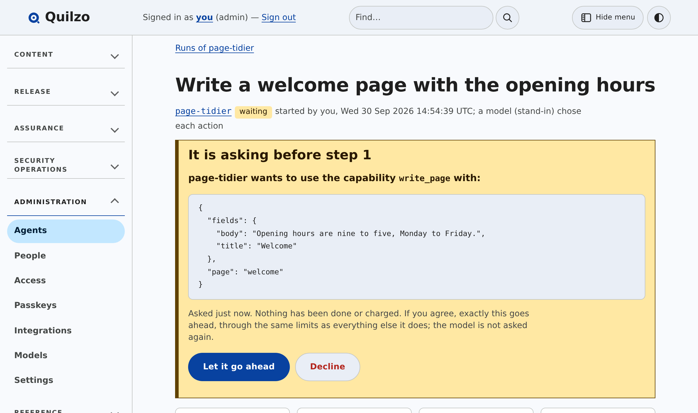

<p align="center">
  <picture>
    <source media="(prefers-color-scheme: dark)" srcset="docs/brand/quilzo-dark.svg">
    
  </picture>
</p>

<h1 align="center">Quilzo</h1>

<p align="center"><strong>AI agents that ask before they act.</strong></p>

<p align="center">
  The open-source platform for building agents you can put in front of real
  systems.<br>
  Declare what an agent may do. Watch every step it takes. Approve the ones
  that matter.
</p>

<p align="center">
  <a href="https://github.com/quilzo/quilzo/actions/workflows/ci.yml"></a>
  <a href="LICENSE"></a>
  <a href="LICENSING.md"></a>
  <a href="go.mod"></a>
  <a href="#measured-not-asserted"></a>
</p>

<p align="center">
  <a href="#quickstart">Quickstart</a> ·
  <a href="#why-quilzo">Why Quilzo</a> ·
  <a href="#what-is-in-the-box">What is in the box</a> ·
  <a href="https://quilzo.github.io">Documentation</a>
</p>

<p align="center">
  
</p>

---

Most agent frameworks give a model your tools and a system prompt asking it to
behave. Then the model reads a web page, an email or a support ticket that
somebody else wrote, and it does what the page says.

Quilzo starts from the other end. **The model never holds the authority.** Every
agent has a declaration — what it may do, over what, on what budget — and one
gate that every action passes through. A hijacked agent can still only do what
it declared before anybody talked to it.

One static binary. Go. No third-party dependencies. Runs on a laptop, with a
local model if you want one.

## Quickstart

```bash
git clone https://github.com/quilzo/quilzo && cd quilzo
go build -o quilzo ./cmd/quilzo      # Go 1.27 or later, nothing to fetch

./quilzo init                        # a store in the current directory
./quilzo demo                        # something for an agent to work on
./quilzo agent new helper --kind retrieval
./quilzo agent run helper            # walks its declaration; needs no model
./quilzo serve --open                # the Studio, in your browser
```

Point it at a model and let the model choose:

```bash
export QUILZO_MODEL_URL=http://127.0.0.1:11434/v1   # Ollama, or any OpenAI-compatible endpoint
export QUILZO_MODEL=llama3.1

./quilzo agent run --model helper "Which page explains refunds, and what does it say?"
./quilzo agent runs                  # every run is kept
./quilzo agent trace RUN             # and can be read step by step
```

The agent builder and kept runs are on `main` and will be in the next release.
Released binaries and the container image are under [Install](#install).

## Why Quilzo

**A declaration, not a prompt.** An agent is one reviewable document. The model
picks from the list in it and cannot add to the list.

```json
{
  "name": "page-tidier",
  "kind": "task",
  "purpose": "Draft small fixes to pages, asking before each change",
  "capabilities": ["list_pages", "read_page", "write_page"],
  "autonomy": "draft",
  "ask_first": ["write_page"],
  "budget": { "steps": 25, "tool_calls": 15, "duration": "10m0s" }
}
```

**A human in the loop that holds.** Put a capability under `ask_first` and the
run stops before using it. A person sees the exact call. If they agree, that
call goes ahead and no other: the model is not asked again, and the approved
action still passes the same gate as everything else.

**Every run is kept.** Each step, whether it was allowed, and what came back,
written as it happens. A run that was cut off can be continued. A finished run
can be run again from any step.

**It knows what the agent read.** Reading content somebody else could have
written marks the run, and records which pages, listings and tools it read.
Work from a marked run needs a person before it goes public.

**A budget it cannot argue with.** Steps, tool calls and time are capped per
run. An agent talked into a loop stops.

**A model cannot approve its own work**, declare an agent, or widen one.

### Measured, not asserted

Against [AgentDojo](https://github.com/ethz-spylab/agentdojo) v1.2.1, assuming
the attack has already won completely — the model hijacked and emitting the
attacker's calls verbatim — and asking only the gate:

```
  attacks refused        26/26 (100%)
  tasks unattended       71/97 (73%)
  tasks needing a person 26/97 (27%)
  tasks refused outright  0/97 (0%)
```

An attack the gate refuses cannot succeed for any model, so the first line is a
lower bound rather than an estimate. It is a measurement of the gate, not of a
model completing tasks, and nine injection tasks that AgentDojo scores by
environment state are excluded.
[scripts/agentdojo/README.md](scripts/agentdojo/README.md) has the method, the
mapping and its weaknesses. Reproduce it in seconds, with no API key:

```bash
python3 scripts/agentdojo/score.py --quilzo ./quilzo
```

## What you can build

- **An assistant that answers from your own content**, cites its sources, and
  refuses what it should refuse. `quilzo assistant add`, and `assistant eval`
  to measure it.
- **An agent that drafts and edits**, stopping for a person before each change
  or before anything is published.
- **A supervisor that hands work to named specialists**, each inside its own
  limits, with what they read folded into one record.
- **A security analyst** that makes a first pass over an alert queue and can
  only suggest. `quilzo analyst triage`, and `analyst eval` for how often it
  agrees with what people ruled.
- **A typed decision with a confidence gate**: the model answers a fixed
  question, and under the threshold a person decides. `quilzo decide`.
- **An automation whose books add up**: every step of a flow accounted for.
  `quilzo flow demo`.

Eight starting points ship, each with its narrow defaults: `retrieval`, `task`,
`copilot`, `autonomous`, `supervisor`, `archivist`, `learner` and `operator`.
`quilzo agent templates` says when to reach for each.

## What is in the box

| | |
|---|---|
| **Agent Studio** | Declare an agent in the browser or as text. A map of what it reads and may do, drawn from the declaration. Try it, and read the run. |
| **Durable runs** | Checkpointed after every step. Pause for a person, continue, replay from a step. |
| **Model gateway** | Routes with fallback, a budget per caller, and a ledger of what each one spent. Works with any OpenAI-compatible endpoint, local or hosted. |
| **MCP, both ways** | An MCP server so other agents can use Quilzo (`quilzo mcp`), and an MCP client so Quilzo agents can use tools you have approved, by host. |
| **Agent card** | An A2A card at `/.well-known/agent-card.json` stating permissions, budgets and provenance before another system asks for anything. |
| **Assistants** | Chatbots that answer from indexed content, with citations, an evaluation harness, and a widget for your site. |
| **Watchdog** | Notices an agent that keeps trying what it was refused. `quilzo agents`. |
| **Traces** | OpenTelemetry spans for every run, to the collector you already have. |
| **Audit log** | Hash-chained. A run a model drove is recorded as the model, with the person who started it beside it. |

### Security operations, built on the same rules

Agents are useful where the stakes are, so Quilzo ships a security console that
uses them under the same limits.

- **Collect** sign-in and audit logs from Okta, Microsoft Entra, GitHub and EVM
  chains directly, and from anything else as a file.
- **Detect and correlate** with rules for identity, code, cloud and chain that
  ship with their own test fixtures, joined across platforms by person.
- **Triage** with an analyst agent that reads a fixed plan and can only suggest.
- **Respond** with incidents, playbooks, and actions on other tools that a
  second person must approve. Each action shows the exact request first.
- **Prioritise vulnerabilities** by exploitation and exposure rather than by
  severity alone, with reachability, SSVC and VEX.

### A content platform underneath

Agents need something real to work on. Quilzo began as a content management
system whose stored content is immutable, whose publish moves a pointer, and
whose template language cannot execute anything. All of that is still here, and
it is what the agents read and write. [docs/cms.md](docs/cms.md) is the full
reference.

## Where it fits, and where it does not

Libraries such as LangChain and LangGraph give you parts to assemble in Python.
Canvas tools such as n8n and Dify give you a visual builder. Quilzo is a running
system: the limits are enforced outside the model, in the program, and they
apply the same way from the browser, the command line and MCP.

Choose something else if:

- **You want a drag-and-drop canvas.** The Studio is a form, a text document and
  a diagram drawn from it. A canvas is planned and not built.
- **You want a Python or TypeScript SDK.** Quilzo is a binary you run and talk
  to over HTTP, the command line or MCP.
- **You need hundreds of ready-made integrations today.** Tools are reached
  through MCP servers you approve by host. There is no marketplace.
- **You need commercial support or a 1.0.** There is one maintainer and no 1.0
  yet. [GOVERNANCE.md](GOVERNANCE.md) says what it takes to change that.
- **Your employer forbids AGPL code.** Some do. See [Licence](#licence).

## Install

**From source** — the quickstart above. `go.mod` has no `require` block, so
there is nothing to download but the Go toolchain.

**A release binary** — Linux, macOS and Windows, amd64 and arm64:

```bash
curl -LO https://github.com/Quilzo/Quilzo/releases/latest/download/quilzo-linux-amd64
curl -LO https://github.com/Quilzo/Quilzo/releases/latest/download/SHA256SUMS
sha256sum -c --ignore-missing SHA256SUMS
gh attestation verify quilzo-linux-amd64 --repo Quilzo/Quilzo
sudo install -m 0755 quilzo-linux-amd64 /usr/local/bin/quilzo
```

**A container** — built on `gcr.io/distroless/static-debian12:nonroot`: the
binary, CA certificates and a passwd entry. No shell and no package manager.

```bash
docker run --rm -v quilzo:/srv ghcr.io/quilzo/quilzo --root /srv/store init
docker run --rm -v quilzo:/srv ghcr.io/quilzo/quilzo --root /srv/store demo
docker run -p 8081:8081 -v quilzo:/srv \
  ghcr.io/quilzo/quilzo --root /srv/store site --addr 0.0.0.0:8081
```

[INSTALL](INSTALL) covers running it for real: the admin on loopback, the site
on the interface that faces the internet, and what each process may touch.

## Documentation

**[quilzo.github.io](https://quilzo.github.io)** — the manual, with
screenshots. Every screen in the admin has a Help link to its own section.

- [Agents](https://quilzo.github.io/#agents): declaring one, asking first, runs
- [Detection](https://quilzo.github.io/#detection) and
  [cases](https://quilzo.github.io/#cases): the security console
- [docs/cms.md](docs/cms.md): the content platform, in full
- [SECURITY.md](SECURITY.md): what is and is not bounded, and how to report

## Licence

Two licences, and you choose: `AGPL-3.0-or-later OR LicenseRef-Quilzo-Commercial`.

**AGPL-3.0-or-later unless you have signed the other one.** It needs no
permission, key or conversation. You may host Quilzo, modify it, charge for it
and build a business on it. If you run a modified Quilzo as a service for other
people, those people can have the source.

The commercial licence is for organisations that cannot take AGPL code, and for
vendors embedding Quilzo in a product they will not release under the AGPL. It
changes your terms and not the program: **there is one Quilzo**, with no feature
held back for paying licensees. [LICENSING.md](LICENSING.md) has the detail and
the project's licensing history.

## Contributing

Quilzo wants maintainers, not only patches. Three merged pull requests of
substance and you can have commit access; the bar is written down in
[GOVERNANCE.md](GOVERNANCE.md).

[CONTRIBUTING.md](CONTRIBUTING.md) has the two-minute path from clone to a
running system, the one rule that will surprise you (no dependencies), and how
review works. Contributions need a sign-off and a [contributor licence
agreement](CLA.md); copyright stays with you. Security reports go through
[SECURITY.md](SECURITY.md), privately.
